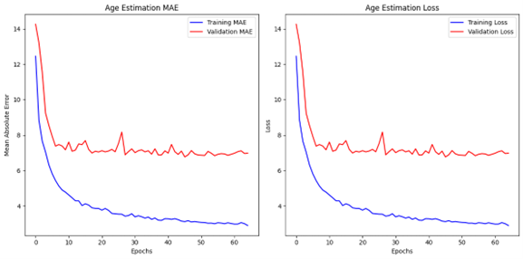
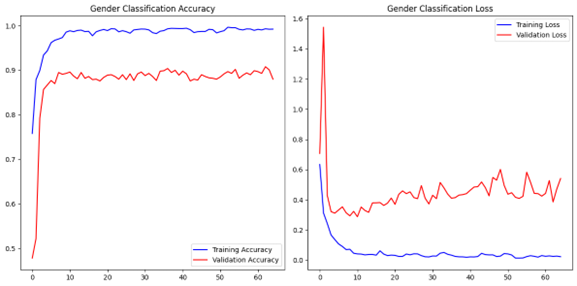
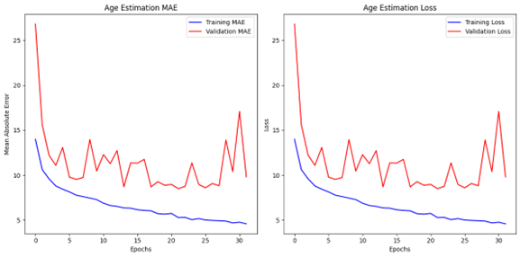
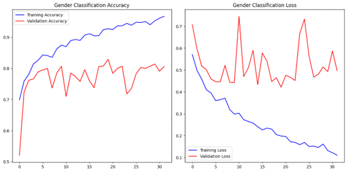

# Age and Gender Prediction using CNN and Transfer Learning

This repository contains the implementation of a Convolutional Neural Network (CNN) and a transfer learning model using ResNet50 for age and gender prediction from facial images. The dataset used for training is a subset of the UTKFace dataset containing 5000 images.

## Table of Contents
- [Introduction](#introduction)
- [Dataset](#dataset)
- [Data Preprocessing](#data-preprocessing)
- [Model Architecture](#model-architecture)
- [Training](#training)
- [Results](#results)
- [Requirements](#requirements)
- [Acknowledgements](#acknowledgements)

## Introduction
The goal of this project is to predict the age and gender of individuals from facial images using deep learning techniques. Two models have been implemented:
1. A custom CNN model.
2. A transfer learning model using ResNet50.

## Dataset
The dataset used for training and validation is a subset of the UTKFace dataset, containing 5000 images. Each image is labeled with age and gender information.

## Data Preprocessing
- Images are resized to 128x128 pixels.
- Normalized the pixel values by dividing by 255.
- Split the dataset into training and validation sets.

## Model Architecture

### Custom CNN Model
- **Input Layer:** 128x128x3
- **Convolutional Layers:** Four convolutional layers with 64, 128, 256, and 512 filters respectively, each followed by MaxPooling and BatchNormalization.
- **Dense Layers:** Two dense layers with 512 units each, followed by Dropout.
- **Output Layers:** Two separate output layers for gender classification (binary classification) and age prediction (regression).

### Transfer Learning Model (ResNet50)
- **Base Model:** ResNet50 pretrained on ImageNet, with top layers removed.
- **Top Layers:** Added Flatten, Dense layers, and output layers similar to the custom CNN model.
- **Training:** Fine-tuned the last 30 layers of ResNet50.

## Training
- **Optimizer:** Adam
- **Loss Functions:** Binary crossentropy for gender classification, mean absolute error (MAE) for age estimation.
- **Metrics:** Accuracy for gender classification, MAE for age estimation.
- **Early Stopping:** Implemented to stop training when validation loss does not improve for 10 consecutive epochs.

## Results

### Model A
- **Validation Accuracy for Gender Classification:** 0.9020000100135803
- **Validation Error for Gender Classification:** 0.4227900505065918
- **Validation MAE for Age Estimation:** 6.835406303405762
- **Validation Error for Age Estimation:** 6.835406303405762

### Model B
- **Validation Accuracy for Gender Classification:** 0.800000011920929
- **Validation Error for Gender Classification:** 0.4665878117084503
- **Validation MAE for Age Estimation:** 8.508588790893555
- **Validation Error for Age Estimation:** 8.508588790893555

## Requirements
- TensorFlow
- Keras
- NumPy
- Pandas
- Matplotlib
- Seaborn
- PIL
- tqdm

## Acknowledgements
- The dataset used in this project is a subset of the UTKFace dataset.
- The ResNet50 model is pretrained on ImageNet.
